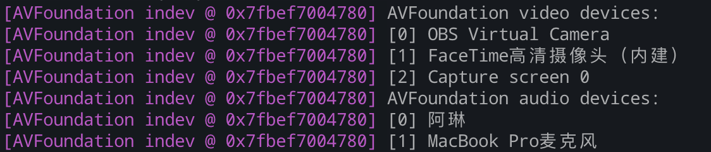

# node-media-server-demo
> 利用[node-server-server]()搭建的简单流媒体服务器 ， 代码备份

### 主要功能如下
1. 接收 rtmp 推流， 并可以通过 rtmp 、或者 http+flv 方式拉流
2. 可转换为 HLS (.m3u8) 和 DASH (.mdp)
3. 支持 https 


### 说明
1. 修改了 rtmp 协议默认端口（1935 -> 1936）
2. flv格式流地址示例 ： `http://domain:8000/live/app/xxx.flv` , 其中 `xxx` 为 推流时填写的字符串。 如：推流地址填写的 `rtmp://localhost:1936/live/aaa`

| 推流地址 | rtmp://localhost:1936/live/aaa |
| :---: | :---: |
| http+flv| http://localhost:8000/live/aaa.flv |
| HLS | http://localhost:8000/live/aaa/index.m3u8 |
| DASH | http://localhost:8000/live/aaa/index.mpd |

3. 如果利用 ffmpeg 推本机电脑摄像头采集的流，推流命令如下：
  ```sh
  ffmpeg -f avfoundation -framerate 30 -video_size 1280x720 -i 1 -vcodec libx264 -acodec libfaac -f flv rtmp://localhost:1936/live/aaa
  ```
  其中 `-i` 输入为 `ffmpeg -f avfoundation -list_devices true -i ""`命令输出的结果，例如：
  